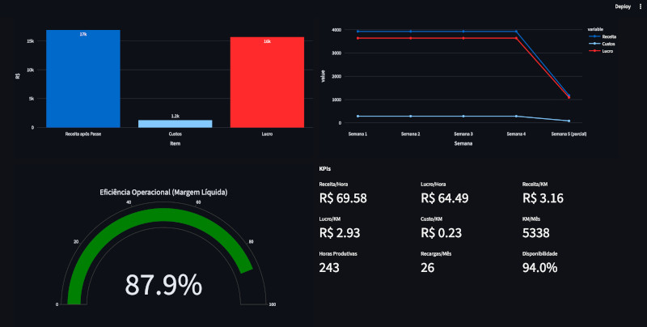

# Driver Simulator

[](https://www.python.org/downloads/) [](https://streamlit.io/) [](https://github.com/jeffotoni/driversimulador/blob/main/LICENSE)  


Professional financial simulator for ride-hailing drivers, currently optimized for Uber and designed to expand to additional platforms in future releases.
It includes full BYD model coverage (BEV and PHEV), vehicle-aware operating math, scenario analysis, weekly projections, and dashboard analytics.



## Features

- Configurable vehicle catalog (including BEV and PHEV models)
- Financial model toggle: commission mode vs pass mode (24h/72h)
- Revenue mix by category (Black / Comfort)
- Advanced operating cost controls
- Multi-tab Streamlit interface:
  - `Configurar`
  - `Resumo`
  - `Semanal`
  - `Cenários`
  - `Dashboard`

## Requirements

- Python 3.12+ (recommended)
- `pip`
- Docker + Docker Compose (optional, for container run)

## Quick Start (Local - macOS)

```bash
git clone https://github.com/jeffotoni/driversimulador.git
cd driversimulador

# 1) Install Python (if needed)
brew install python@3.12

# 2) Create and activate virtual environment
python3 -m venv .venv
source .venv/bin/activate

# 3) Install dependencies
pip install --upgrade pip
pip install -r requirements-dashboard.txt

# 4) Run app
streamlit run dashboard.py
```

Open: `http://localhost:8501`

## Quick Start (Local - Linux)

```bash
git clone https://github.com/jeffotoni/driversimulador.git
cd driversimulador

# 1) Install Python tooling (Debian/Ubuntu)
sudo apt update
sudo apt install -y python3 python3-venv python3-pip

# 2) Create and activate virtual environment
python3 -m venv .venv
source .venv/bin/activate

# 3) Install dependencies
pip install --upgrade pip
pip install -r requirements-dashboard.txt

# 4) Run app
streamlit run dashboard.py
```

Open: `http://localhost:8501`

## Quick Start (Docker Compose - Local)

```bash
git clone https://github.com/jeffotoni/driversimulador.git
cd driversimulador

# Build and start
docker compose up -d --build

# Check service status
docker compose ps

# Follow logs
docker compose logs -f
```

Open: `http://localhost:8501`

Stop:

```bash
docker compose down
```

## Project Files

- `dashboard.py`: Streamlit UI and charts
- `simulador.py`: core simulation logic
- `requirements-dashboard.txt`: Python dependencies
- `Dockerfile`: container image definition
- `docker-compose.yml`: local container orchestration

## License

This project is licensed under the terms of the [LICENSE](LICENSE) file.
